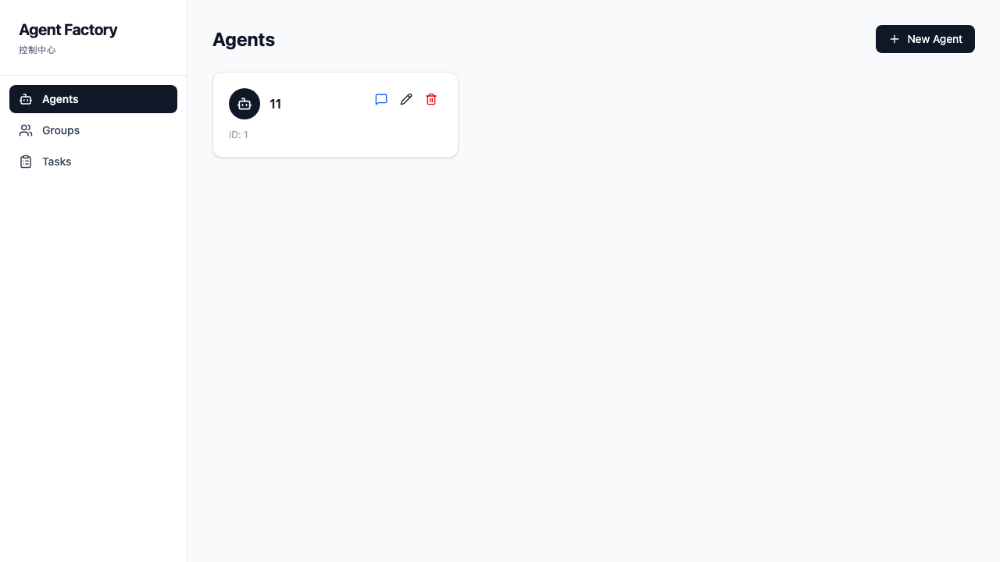
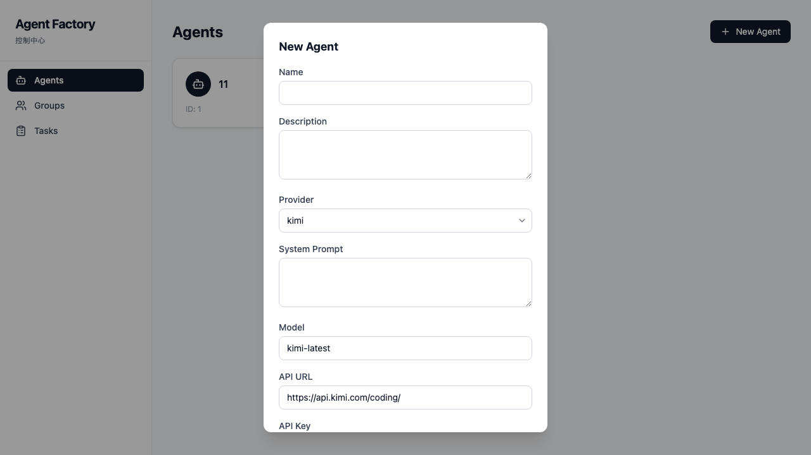
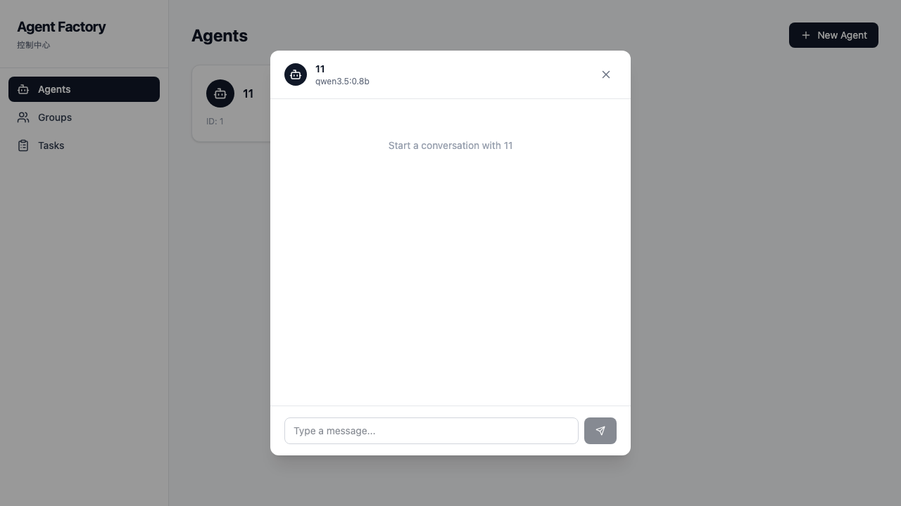

# Agent Factory

> 一个支持多供应商 LLM 的全栈 Agent 管理控制台，支持 Agents / Groups / Tasks Kanban 看板 + 实时对话。

---

## 功能截图

### Agents 列表页



### 新建 Agent 弹窗



### 实时对话弹窗



---

## 功能特性

### Agent 管理

增删改查 Agents，支持多供应商配置（Kimi / Ollama / OpenAI / Custom）。每个 Agent 可独立设置名称、Provider、模型、API Key、System Prompt 等参数，以卡片形式清晰展示。

### 实时对话

基于 LangChain + SSE 流式传输，选中 Agent 后一键开启对话。每个 Agent 独立配置 API Key / Model / System Prompt，消息实时打字机式输出，对话体验流畅自然。

### Group 管理

多选 Agent 快速建组，支持为 Group 命名、编辑成员。Group 页面直观展示组内成员列表，方便批量管理相关 Agents。

### Task Kanban

三列看板（To Do / In Progress / Done），支持拖拽改状态。Task 可分配给单个 Agent 或整个 Group，直观追踪任务进度。

### 多供应商支持

下拉选择供应商，自动填充默认配置。内置 Kimi、Ollama、OpenAI、Custom 四种 Provider 模板，快速对接不同 LLM 服务。

---

## 技术栈

- **后端**：Python 3.11 + FastAPI + SQLAlchemy + SQLite + LangChain + LangChain-OpenAI
- **前端**：React 19 + TypeScript + Vite + Tailwind CSS v4 + @dnd-kit + TanStack Query + Zustand + Axios + Lucide React
- **架构**：REST API + SQLite 本地存储，前后端通过 Vite Proxy 直连

---

## 快速开始

```bash
# 后端
cd backend && ./run.sh

# 前端
cd frontend && npm run dev
```

打开 http://localhost:5173

---

## API 说明

| 端点 | 说明 |
|------|------|
| `GET/POST /api/agents` | Agent 列表 / 创建 Agent |
| `GET/PUT/DELETE /api/agents/{id}` | 获取 / 更新 / 删除 Agent |
| `POST /api/agents/{id}/chat` | 与指定 Agent 实时对话（SSE） |
| `GET/POST /api/groups` | Group 列表 / 创建 Group |
| `GET/PUT/DELETE /api/groups/{id}` | 获取 / 更新 / 删除 Group |
| `GET/POST /api/tasks` | Task 列表 / 创建 Task |
| `GET/PUT/DELETE /api/tasks/{id}` | 获取 / 更新 / 删除 Task |

---

## License

[MIT](LICENSE)
