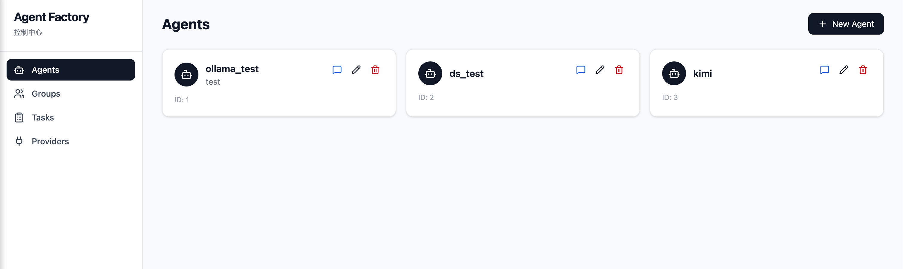
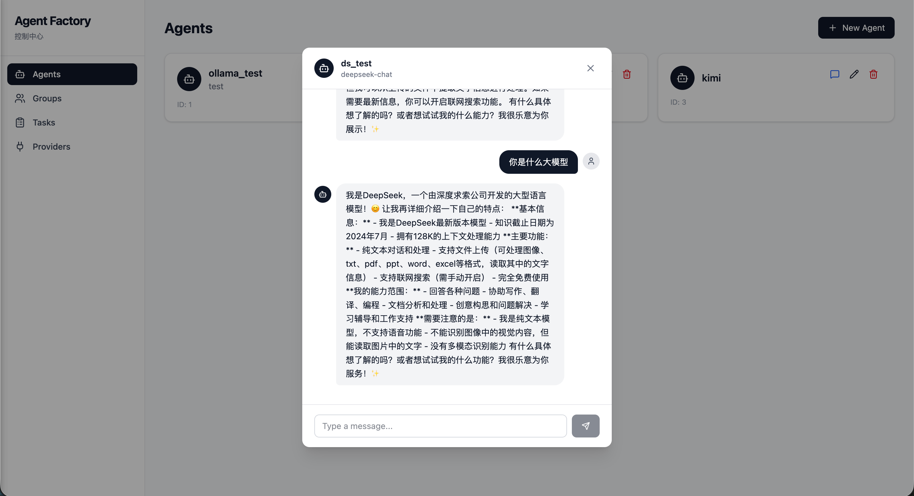
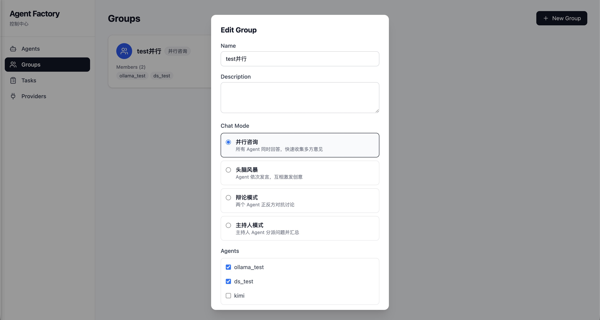
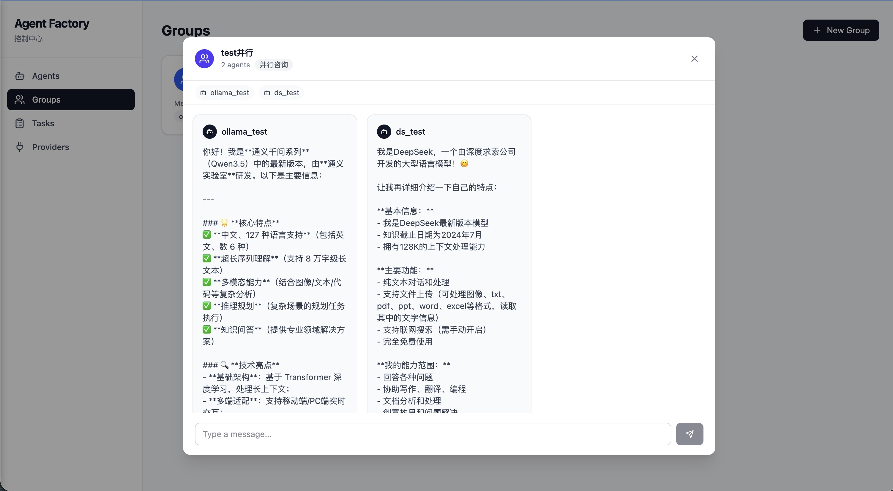
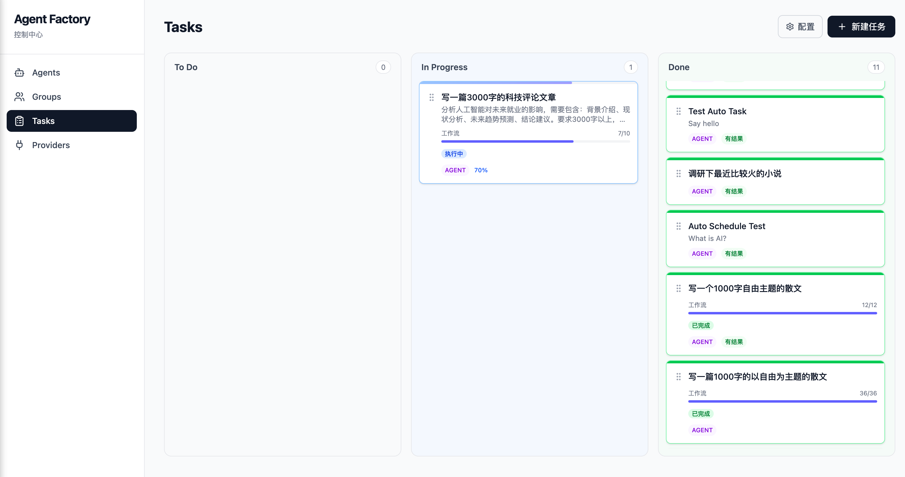
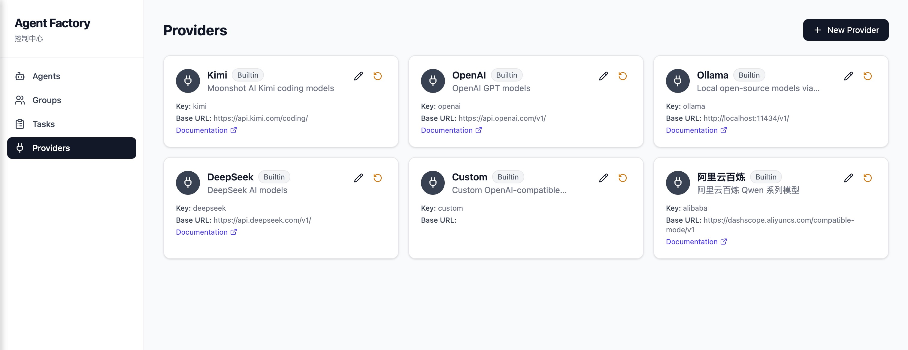
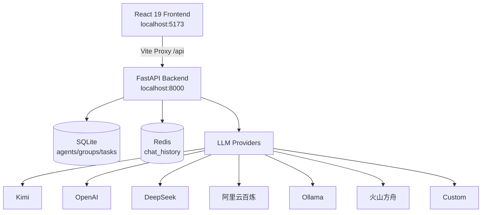
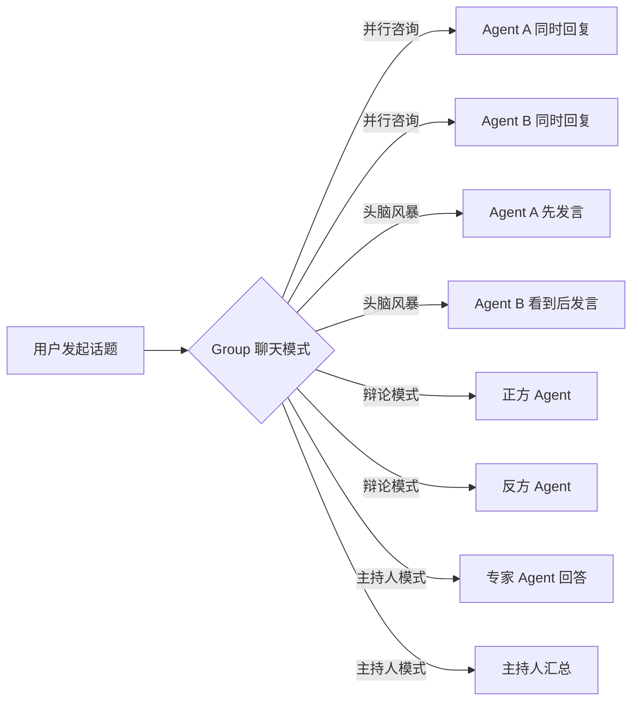
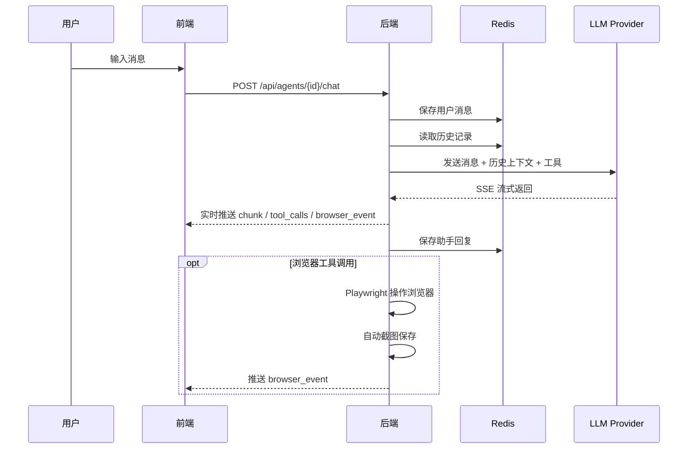
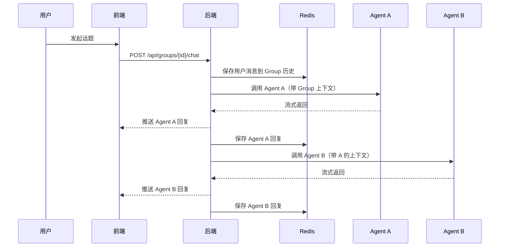

# Agent Factory

> 支持多供应商 LLM 的全栈 Agent 管理控制台，具备 Agents / Groups / Tasks 看板管理、实时对话、Group 多模式协作聊天能力。

---

## 🖥 界面预览

### Agents 管理页

Agent 卡片列表，支持一键对话、编辑、删除。



### Agent 实时对话

基于 SSE 流式传输，打字机式输出，对话历史自动保存到 Redis。



### Group 多模式协作

创建 Group 时可选择 4 种聊天模式：



**并行咨询模式** — 所有 Agent 同时回答，多卡片并排显示：



### Task Kanban 看板

三列拖拽看板，Task 可分配给 Agent 或 Group，支持拖拽改状态、工作流进度实时展示。



### Provider 管理中心

内置 6 大供应商，支持自定义添加、模型自动发现、配置重置。



---

## 📐 架构概览



---

## 🚀 功能特性

### 🤖 Agent 管理中心

| 能力 | 说明 |
|------|------|
| CRUD | 创建、编辑、删除、查看 Agent 卡片 |
| 多供应商 | 支持 Kimi / OpenAI / DeepSeek / 阿里云百炼 / 火山方舟 / Ollama / Custom |
| 独立配置 | 每个 Agent 独立设置 Provider、Model、API Key、System Prompt |
| 实时对话 | SSE 流式传输，打字机式输出，支持历史记录持久化 |
| **浏览器自动化** | 开启 `enable_browsing` 后 Agent 可操控 Playwright 浏览器查询任意领域实时数据（新闻、天气、价格等），前端实时显示截图 |
| **数据来源追踪** | Agent 查询网页时自动记录使用的搜索和浏览 URL，聊天消息下方展示可折叠的来源链接 |
| **Thinking 模式** | 支持 DeepSeek reasoner / Kimi K2.6 的思考过程展示 |

### 🔌 Provider 管理中心

| 能力 | 说明 |
|------|------|
| 内置供应商 | 7 个内置 Provider（Kimi / OpenAI / Ollama / DeepSeek / 阿里云百炼 / 火山方舟 / Custom） |
| 自定义供应商 | 添加、编辑、删除自定义 Provider |
| 模型自动发现 | 从 OpenAI-compatible / Ollama API 自动拉取可用模型列表 |
| 重置功能 | 内置供应商支持一键恢复默认配置 |

### 👥 Group 多模式协作

多选 Agent 快速建组，支持 **4 种聊天模式**：



| 模式 | 交互方式 | 适用场景 |
|------|---------|---------|
| **并行咨询** | 所有 Agent 同时回答，多卡片并排显示 | 快速收集多方意见 |
| **头脑风暴** | Agent 依次发言，后发言者能看到之前所有观点 | 创意讨论、方案发散 |
| **辩论模式** | 两个 Agent 正反方对抗，3 轮交锋 | 方案论证、风险评估 |
| **主持人模式** | 专家 Agent 先回答，主持人 Agent 汇总 | 复杂问题分析 |

### 📋 Task Kanban 看板

- 三列看板：To Do / In Progress / Done，支持拖拽改状态
- Task 可分配给单个 Agent 或整个 Group
- **智能工作流引擎**：复杂任务自动拆解为多步骤工作流，LLM 自动规划执行路径
- **产物管理**：每个步骤生成独立产物文件，支持查看、审阅、下载
- **人工确认（Checkpoint）**：关键节点可配置人工确认，默认自动连续执行
- **自动执行**：有执行者的 Task 拖入 In Progress 后自动触发执行
- **并发控制**：可配置最大同时执行任务数，超出自动排队
- **删除任务**：Task 卡片支持删除，级联清理关联的工作流步骤

### 📎 多文件上传与上下文管理

Agent / Group 聊天支持上传文件（txt / pdf / md / 代码等），自动提取文本并在模型上下文窗口限制下进行智能分配：

| 模式 | 说明 |
|------|------|
| **截断模式** | 超长文件保留头尾，中间标注省略，确保不超出预算 |
| **摘要模式** | 调用 LLM 生成结构化摘要，大幅降低 Token 占用 |
| **自动模式** | 短文件用全文，长文件自动切换为摘要 |

上下文预算策略：总预算 = context_window - 2000 reserve，文件 60% + 历史 40%，单文件上限 15,000 字符。

### 📚 文件摘要库

- 文件摘要自动生成后 **SQLite 持久化 + Redis 缓存** 双写
- 前端 📚 摘要库面板：搜索、查看、删除历史摘要
- 聊天时自动注入最近 5 个历史摘要作为上下文，无需重复上传

### 🤖 飞书机器人（WebSocket 长连接）

- 每个 Agent 可独立绑定飞书机器人，无需公网域名
- 后端通过 **WebSocket 长连接**主动连接飞书服务器接收事件
- 支持手动连接 / 断开，前端实时显示连接状态
- 收到飞书消息后自动调用 Agent LLM 回复

### 💬 聊天记录持久化

- Agent 独立聊天历史 → Redis `chat_history:{agent_id}`
- Group 聊天历史 → Redis `group_chat_history:{group_id}`
- 对话时自动加载历史作为 LLM 上下文
- 关闭弹窗后历史不丢失

---

## 🛠 技术栈

| 层级 | 技术 |
|------|------|
| **后端** | Python 3.11 + FastAPI + SQLAlchemy + SQLite + Redis + LangChain 1.x |
| **前端** | React 19 + TypeScript + Vite + Tailwind CSS v4 + TanStack Query + Axios + Lucide React |
| **实时通信** | Server-Sent Events (SSE) |
| **拖拽** | @dnd-kit |
| **架构** | REST API + SQLite 本地存储 + Redis 缓存，前后端通过 Vite Proxy 直连 |
| **桌面应用** | Tauri 2.0 (Rust) + PyInstaller，内嵌 Redis（端口 16379） |

---

## macOS 桌面应用

Agent Factory 提供独立的 macOS 桌面应用，无需安装 Python、Node.js、Redis 等任何依赖，下载即可运行。

### 下载安装

1. 访问 [GitHub Releases](https://github.com/lengfengng1-ai-architect/agent-factory/releases)
2. 下载安装包：`Agent-Factory_vX.X.X_aarch64.dmg`
   - 支持 Apple Silicon (M1/M2/M3) 原生运行
   - Intel Mac 可通过 Rosetta 2 运行
3. 打开 `.dmg`，将 `Agent Factory.app` 拖拽到 `Applications` 文件夹
4. 首次启动时，macOS 会提示"无法验证开发者"，前往 **系统设置 → 隐私与安全性 → 安全性** 中点击"仍要打开"

### 自动更新

桌面应用内置自动更新功能。当有新版本发布时，应用会自动检测并提示下载更新。

### 从源码构建桌面应用

需要 Rust、Node.js、Python 3.11 环境。

```bash
# 1. 构建前端
cd frontend
npm ci
npm run build

# 2. 安装 Playwright 浏览器（桌面端必需）
cd ../backend
uv sync
PLAYWRIGHT_BROWSERS_PATH=./playwright-browsers uv run playwright install chromium-headless-shell

# 3. 构建后端（PyInstaller）
uv pip install pyinstaller
export PYTHONPATH=.
.venv/bin/python -m PyInstaller agent-factory.spec --noconfirm

# 4. 准备二进制
cp backend/dist/agent-factory-backend desktop/src-tauri/binaries/
brew install redis
cp $(which redis-server) desktop/src-tauri/binaries/redis-server

# 5. 构建 Tauri 桌面应用（cargo-binstall 比 cargo install 快很多）
cd desktop/src-tauri
cargo binstall cargo-tauri --locked --no-confirm
cargo tauri build

# 产物：desktop/src-tauri/target/release/bundle/dmg/Agent Factory_*.dmg
```

---

## 📡 数据流

### Agent 单聊流程



### Group 头脑风暴流程



---

## 🏁 快速开始

```bash
# 1. 启动 Redis（如未启动）
docker run -d --name agent-factory-redis -p 6379:6379 redis:7-alpine

# 2. 启动后端
cd backend && ./run.sh

# 3. 启动前端
cd frontend && npm run dev

# 打开 http://localhost:5173
```

---

## 📂 项目结构

```
├── backend/
│   ├── app/
│   │   ├── main.py              # FastAPI 入口
│   │   ├── models.py            # SQLAlchemy 模型（含 SafeJSON）
│   │   ├── schemas.py           # Pydantic 校验
│   │   ├── redis_client.py      # Redis 聊天记录
│   │   ├── llm_factory.py       # Provider-specific LLM 工厂
│   │   ├── task_engine.py       # 任务执行引擎
│   │   ├── workflow_engine.py   # 工作流引擎
│   │   └── routers/
│   │       ├── agents.py        # Agent CRUD
│   │       ├── chat.py          # Agent 单聊 SSE
│   │       ├── group_chat.py    # Group 多模式聊天
│   │       ├── groups.py        # Group CRUD
│   │       ├── models.py        # 模型列表 fallback
│   │       ├── providers.py     # Provider CRUD + 发现
│   │       ├── tasks.py         # Task CRUD
│   │       └── workflow_steps.py # 工作流步骤管理
│   └── run.sh                   # 后端启动脚本
├── frontend/
│   └── src/
│       ├── pages/
│       │   ├── AgentsPage.tsx
│       │   ├── GroupsPage.tsx
│       │   ├── ProvidersPage.tsx
│       │   └── TasksPage.tsx
│       └── components/
│           ├── AgentModal.tsx
│           ├── BrowserPanel.tsx      # 浏览器截图面板
│           ├── ChatModal.tsx
│           ├── GroupChatModal.tsx
│           ├── GroupModal.tsx
│           ├── ProviderModal.tsx
│           ├── TaskCard.tsx
│           ├── TaskModal.tsx
│           └── TaskDetailPanel.tsx
├── desktop/              # Tauri 2.0 桌面应用壳
│   └── src-tauri/        # Rust 源码 + Tauri 配置
└── .hermes/
    └── plans/                   # 开发计划文件（git-ignored）
```

---

## 🔌 API 列表

### Agent
| 端点 | 说明 |
|------|------|
| `GET/POST /api/agents` | Agent 列表 / 创建 |
| `GET/PUT/DELETE /api/agents/{id}` | 获取 / 更新 / 删除 |
| `POST /api/agents/{id}/chat` | 实时对话（SSE），可选 `group_id` |
| `GET /api/agents/{id}/chat/history` | 查询聊天记录 |
| `GET /api/agents/{id}/browser/screenshot` | 获取浏览器实时截图（PNG） |
| `GET /api/agents/{id}/browser/state` | 获取浏览器当前 URL / 标题 |

### Group
| 端点 | 说明 |
|------|------|
| `GET/POST /api/groups` | Group 列表 / 创建 |
| `GET/PUT/DELETE /api/groups/{id}` | 获取 / 更新 / 删除 |
| `POST /api/groups/{id}/chat` | Group 聊天（SSE，brainstorm/debate/moderator） |
| `GET /api/groups/{id}/chat/history` | 查询 Group 聊天记录 |

### Provider
| 端点 | 说明 |
|------|------|
| `GET/POST /api/providers` | Provider 列表 / 创建 |
| `GET/PUT/DELETE /api/providers/{id}` | 获取 / 更新 / 删除 |
| `POST /api/providers/{id}/reset` | 重置内置 Provider |
| `POST /api/providers/{id}/discover` | 自动发现模型列表 |
| `GET /api/providers/{id}/models` | 获取已发现的模型 |

### Task
| 端点 | 说明 |
|------|------|
| `GET/POST /api/tasks` | Task 列表 / 创建 |
| `GET/PUT/DELETE /api/tasks/{id}` | 获取 / 更新 / 删除（级联清理 workflow_steps） |
| `POST /api/tasks/{id}/execute` | 触发任务执行 |
| `POST /api/tasks/{id}/breakdown` | LLM 自动拆解为工作流 |
| `GET /api/tasks/{id}/workflow/progress` | 获取工作流执行进度 |
| `POST /api/tasks/{id}/steps/{step_id}/confirm` | 确认 checkpoint 步骤 |
| `POST /api/tasks/{id}/steps/{step_id}/retry` | 重试失败步骤 |
| `POST /api/tasks/{id}/steps/{step_id}/skip` | 跳过步骤 |

### 文件摘要
| 端点 | 说明 |
|------|------|
| `GET /api/summaries` | 查询摘要列表（支持搜索） |
| `DELETE /api/summaries/{id}` | 删除摘要 |

### 飞书机器人
| 端点 | 说明 |
|------|------|
| `GET /api/feishu/status/{agent_id}` | 查询 WebSocket 连接状态 |
| `POST /api/feishu/connect/{agent_id}` | 手动启动长连接 |
| `POST /api/feishu/disconnect/{agent_id}` | 手动断开长连接 |

---

## 📄 License

[MIT](LICENSE)
